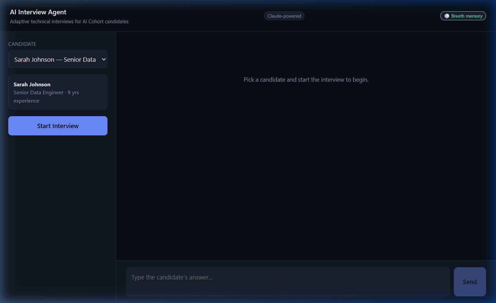
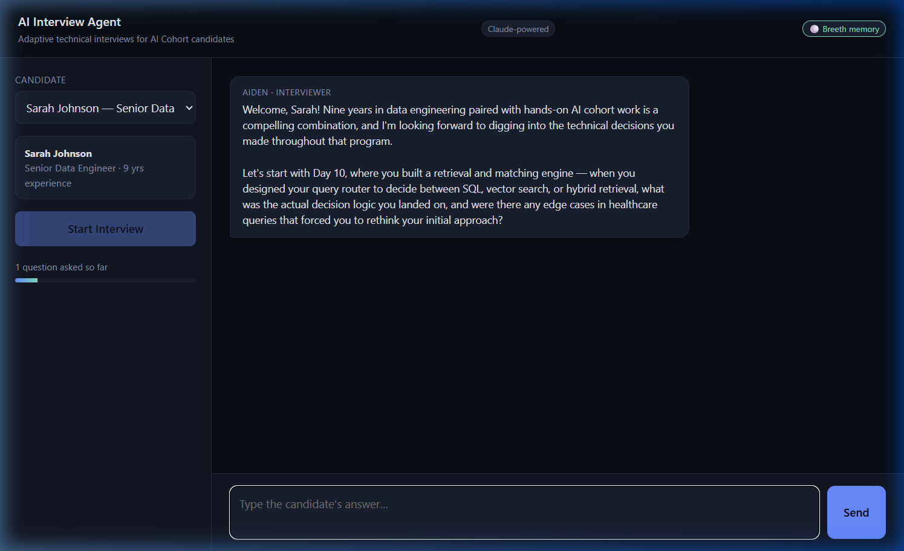
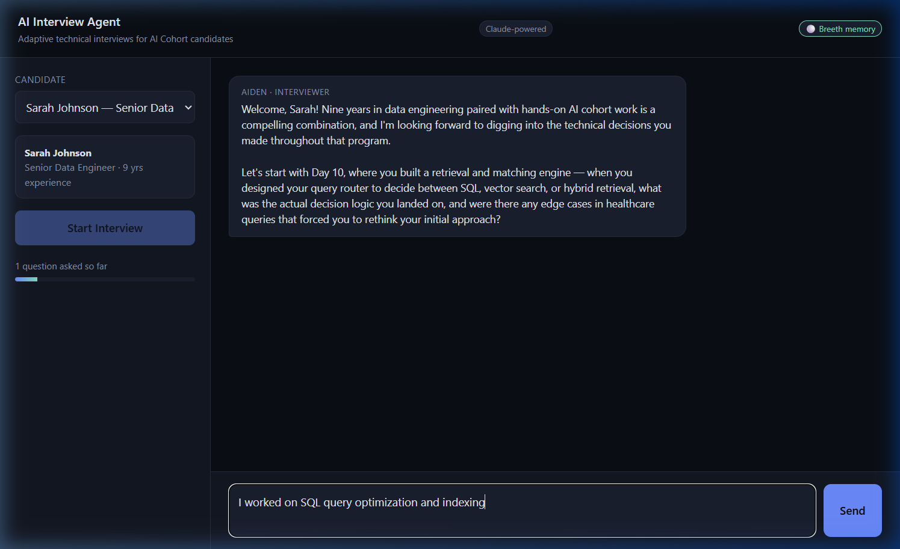
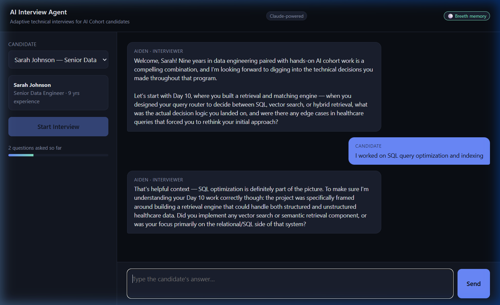

# AI Interview Agent — AI Cohort Technical Interviewer

An adaptive, LLM-driven agent that conducts a realistic, multi-turn technical interview
personalized to each AI Cohort candidate's actual 31-day learning history — not a fixed
quiz, a real interview that reads the transcript before it opens its mouth.

Built for the "AI Interview Agent" hackathon challenge.

## 📸 App Interface Showcase

Here is the AI Interview Agent in action, running with full Claude-powered evaluation and persistent memory through Breeth:

| 1. Select Candidate & Start | 2. Adaptive Interview Commenced |
|:---:|:---:|
|  |  |
| *Active status badges showing Claude and Breeth integration.* | *Deterministic plan generated based on candidate's history.* |

| 3. Dynamic Question & Answer | 4. Final Evaluation & Feedback Synthesis |
|:---:|:---:|
|  |  |
| *Real-time turn handling with conversational, persona-driven questions.* | *Rigorously synthesized Strengths, Gaps, and Next Steps.* |

## Why this is more than a Q&A script

Most "interview bot" submissions ask a fixed list of questions off the curriculum and
call it personalized. This one doesn't. Three engineering decisions make it behave like
an actual interviewer:

1. **Deterministic personalization, generative delivery.** Which topics to ask about is
   decided by a *pure, testable scoring function* (`src/engine/topicPlanner.js`) — never
   by the LLM. It reads each candidate's `missions` (passed / failed / skipped / attempts)
   and `signals` and prioritizes: topics they **failed** > topics they **skipped** >
   topics they **struggled through** (3+ attempts) > topics they **breezed** through.
   This mirrors the same "router before generator" pattern the cohort itself teaches on
   Day 10 (SQL vs. vector vs. hybrid retrieval) — the *what* is deterministic, the *how it's
   phrased* is generative. Judges can read the priority formula and verify it's not a black box.

2. **A silent evaluator drives adaptivity, not vibes.** Every candidate answer is scored
   by a separate internal LLM call (`src/engine/evaluator.js`, using forced tool-use for
   structured output — the same function-calling pattern from Day 13) that the candidate
   never sees. That score decides, in real time, whether to fire a follow-up on the same
   topic (up to 2 per topic) or move on. This is what "ask a minimum of 8 questions...
   generate follow-up questions based on previous responses" actually requires — it can't
   be done with a static question bank.

3. **Feedback is synthesized from the scored transcript, not summarized from raw text.**
   The closing feedback tool call receives every question, every answer, and every
   internal score/verdict — so `strengths` and `gaps` cite specific curriculum days,
   not generic praise.

4. **It never goes down.** Every LLM call point has a deterministic fallback (see
   *Fallback mode* below). A dropped API key, a rate limit, or a network blip degrades
   the interview to templated-but-still-spec-compliant questions instead of a 500 — this
   is the guardrails/production-readiness lesson from Day 27 applied to the agent itself.

5. **Optional persistent memory via Breeth.** If `BREETH_API_KEY` and `BREETH_PROJECT_ID`
   are set, each completed interview is written to [Breeth](https://thebreeth.com) as an
   episode plus a scored fact (`src/engine/breethClient.js`), fire-and-forget, so patterns
   across candidates accumulate over time. Entirely optional and non-blocking — the
   required `/api/interview` response is never delayed or altered by this call, and if it
   fails for any reason the interview is unaffected (failures are logged, not surfaced).

## Architecture

```
                         POST /api/interview
                                │
                       ┌────────▼──────────┐
                       │   server.js       │  plain node:http, zero deps
                       └────────┬──────────┘
                                │
                     ┌──────────▼───────────────┐
                     │src/engine/interviewer.js │  orchestrator / state machine
                     └──────────┬───────────────┘
             ┌──────────────────┼────────────────────────┐
             │                  │                        │
    ┌────────▼────────┐  ┌───────▼────────┐    ┌──────────▼─────────┐
    │ topicPlanner.js │  │ evaluator.js   │    │questionGenerator.js│
    │ (deterministic  │  │ (silent scorer,│    │ (persona-driven    │
    │ priority router)│  │  tool-use JSON)│    │  natural language) │
    └─────────────────┘  └────────────────┘    └────────────────────┘
             │                                              │
             └────────────────────┬─────────────────────────┘
                                  │
                       ┌──────────▼────────────┐
                       │ feedbackSynthesizer.js│  tool-use JSON, grounded
                       └───────────────────────┘
                                  │
                       ┌──────────▼───────────┐
                       │    llmClient.js      │  fetch() → api.anthropic.com
                       │  (zero SDK deps)     │  every call has a fallback path
                       └──────────────────────┘
```

Session state lives in an in-memory `Map` (`src/store/sessionStore.js`) keyed by
`sessionId`, swept on a 3-hour TTL. No database — matches the brief's "no persistent
user accounts / long-term history" out-of-scope note.

## API contract (per Technical Specification)

Single required endpoint, exactly as specified:

```
POST /api/interview
```

**Start:**
```bash
curl -X POST http://localhost:3000/api/interview \
  -H 'content-type: application/json' \
  -d '{"sessionId":"abc-123","candidate": { ...candidate.json entry... }}'
# -> {"reply":"...", "done": false}
```

**Turn:**
```bash
curl -X POST http://localhost:3000/api/interview \
  -H 'content-type: application/json' \
  -d '{"sessionId":"abc-123","message":"I used ChromaDB for vector storage..."}'
# -> {"reply":"...", "done": false}
```

**Completion** (after >= 8 questions across >= 4 distinct curriculum days):
```json
{
  "reply": "Thanks, Emily Chen — that concludes the interview. Nice work today.",
  "done": true,
  "feedback": {
    "summary": "...",
    "strengths": ["..."],
    "gaps": ["..."],
    "next": ["..."]
  }
}
```

The candidate object accepted on start is defensively normalized
(`src/engine/profileAnalyzer.js:normalizeCandidate`) — it accepts a single candidate
entry `{ member, missions, signals }`, `{ candidate: {...} }`, or `{ candidates: [...] }`
so minor grading-harness variations in payload shape don't break the contract.

### Additive convenience endpoints (not required by spec)

- `GET /api/candidates` — list of candidates for the demo UI dropdown
- `GET /api/candidates/:id` — a single full candidate object, ready to drop into `candidate`
- `GET /api/health` — `{ status, llmEnabled, minQuestions, minDays, maxQuestions }`
- `GET /api/debug/:sessionId` — question/day counters for self-verification (used by `npm test`)

## Personalization logic

`buildInterviewPlan(candidate)` scores every mission the candidate touched:

| Category | Priority | Why |
|---|---|---|
| Failed (`passed: false`) | 100 | Didn't pass on the platform — the real gap needs probing |
| Skipped | 85 | Tests self-study/awareness, not just platform completion |
| Struggled (passed, 3+ attempts) | 70 | Checks whether the eventual pass reflected real understanding |
| First-try pass | 40 | Validates depth, not just recall, on their strongest areas |

It then picks up to 6 topics, favoring one per curriculum **module** first (so the
interview naturally spans RAG, agents, deployment, etc.) before filling remaining slots
by priority, and orders them for a natural interview arc: warm-up (strength) → deep
probe (struggle/failure) → integrity check (skipped topics) → closing synthesis question.

If a candidate's plan runs out before hitting 8 questions / 4 days (very sparse
profiles), `pickAdditionalTopic` pulls another topic from their remaining missions, and
as an ultimate fallback, from the curriculum at large — so the minimum is *structurally*
guaranteed, not just typical. Verified against a deliberately sparse profile in
`npm test`.

## Fallback mode (no API key required to run)

If `ANTHROPIC_API_KEY` is unset — or the API call fails, times out, or rate-limits — every
LLM call point (`evaluator`, `questionGenerator`, `feedbackSynthesizer`) falls back to a
deterministic, curriculum-grounded implementation:

- Questions are built directly from the day's `objectives` (no repeats within a topic).
- Answers are scored heuristically (response length + vocabulary overlap with the day's
  tools/title, "I don't know"-style detection).
- Feedback is synthesized from per-day average scores.

The interview still fully satisfies the spec's minimums in this mode — `GET /api/health`
reports `llmEnabled: false` (and `breethEnabled: false`) so you can see which mode is
active. This means the live demo URL keeps working even if a key expires or gets
rate-limited mid-judging. Every LLM call site (`evaluator.js`, `questionGenerator.js`,
`feedbackSynthesizer.js`) logs a `console.warn` with the underlying error whenever it
falls back, so a misconfigured key shows up in server logs instead of failing silently.

## Setup

Zero npm dependencies — pure Node.js built-ins (`node:http`, global `fetch`). Nothing to
`npm install`.

```bash
cp .env.example .env
# edit .env and set ANTHROPIC_API_KEY for full LLM-driven interviews
node server.js
# -> http://localhost:3000  (chat demo UI + API)
```

`.env` is loaded automatically at startup by `src/util/loadEnv.js` (a ~20-line
zero-dependency parser, imported first in `server.js` so it runs before any module reads
`process.env`) — no `dotenv` package or `--env-file` flag needed. `.env` is gitignored;
`.env.example` holds only blank placeholders and is safe to commit.

Node >= 18.17 required (uses global `fetch`, ES modules).

> **Note on this build's dev environment:** this project was built and tested inside a
> sandboxed agent environment whose outbound networking only permits Node's `fetch()` to
> reach a small allowlist — `api.anthropic.com` and `api.thebreeth.com` were not reachable
> from within it (DNS resolution failed outright), so the LLM-driven and Breeth code paths
> could only be verified by static review (request shape, auth headers, and tool schemas
> checked against the documented Anthropic Messages API format) and by confirming the
> fallback path activates correctly and logs the real error. **Run `npm test` with a real
> `ANTHROPIC_API_KEY` set locally or after deploying** to confirm live LLM behavior before
> relying on it for judging — the sandbox constraint does not apply to normal hosting
> (Render/Railway/your own machine all have unrestricted outbound internet).

## Testing

```bash
npm test
```

Runs a full simulated interview end-to-end against a live local server and asserts:
- >= 8 questions asked
- >= 4 distinct curriculum days covered
- the interview terminates with `done: true` and a structurally valid `feedback` object

## Deployment

This is a plain long-running Node process (no build step, no framework), so it deploys
anywhere that runs `node server.js`:

**Render / Railway / Fly.io:**
- Build command: *(none)*
- Start command: `node server.js`
- Env vars: `ANTHROPIC_API_KEY`, optionally `ANTHROPIC_MODEL`

**Docker:**
```bash
docker build -t interview-agent .
docker run -p 3000:3000 -e ANTHROPIC_API_KEY=sk-... interview-agent
```

## Project structure

```
server.js                        entry point, routing, static file serving
src/util/loadEnv.js               zero-dependency .env loader, imported first in server.js
src/data/loadData.js              loads curriculum.json / candidates.json, day/module lookups
src/engine/profileAnalyzer.js     normalizes + categorizes a candidate's mission history
src/engine/topicPlanner.js        deterministic topic priority + interview plan builder
src/engine/llmClient.js           zero-dependency Claude API client (fetch-based) + fallback signal
src/engine/evaluator.js           silent per-answer scorer (LLM tool-use + heuristic fallback)
src/engine/questionGenerator.js   opening/follow-up/transition/closing question generation
src/engine/feedbackSynthesizer.js final structured feedback (LLM tool-use + heuristic fallback)
src/engine/breethClient.js        optional Breeth memory-graph integration (fire-and-forget)
src/engine/interviewer.js         orchestrator / state machine tying it all together
src/store/sessionStore.js         in-memory session state with TTL sweep
src/routes/*.js                   HTTP route handlers
public/index.html                 single-file demo chat UI
scripts/testInterview.js          end-to-end contract test
scripts/discoverBreeth.js         one-off CLI to discover your Breeth project_id
data/                              copies of the provided curriculum.json / candidates.json
```

## Out of scope (per brief)

Voice interaction, authentication, persistent accounts, long-term cross-session history,
and mobile apps are intentionally not implemented.

## License

MIT
